### Basic Kubernetes (K8s) for Web Developer ออนไลน์
---
### ⚡ Day 1

- [ ] Section 1: การเตรียมเครื่องมือและบน Mac และ Windows
- [ ] Section 2: การพัฒนา Application The Twelve Factors
- [ ] Section 3: ทบทวนการใช้งาน Docker

##### 💾 ดาวน์โหลดเอกสารประกอบการเรียนรู้
📥 [Basic Kubernetes (K8s) for Web Developer](https://bit.ly/basic-k8s-online)

##### 🔨 Tools & Environment Setup
📥 [Docker Desktop](https://docs.docker.com/desktop/)
📥 [Visual Studio Code พร้อมส่วนเสริมที่จำเป็น](https://code.visualstudio.com/download)
📥 [Git](https://git-scm.com/downloads)
📥 [LENS IDE](https://k8slens.dev/)

#### 📚 Section 1: การเตรียมเครื่องมือและบน Mac และ Windows
##### 💻 ตรวจสอบเวอร์ชั่นของแต่ละเครื่องมือ
ตรวจสอบเวอร์ชั่นของ Docker
```bash
docker --version
```

ตรวจสอบเวอร์ชั่นของ Kubernetes
```bash
kubectl version
```

ตรวจสอบสถานะของ Kubernetes
```bash
kubectl cluster-info
kubectl get nodes
kubectl get pods --all-namespaces
```

ตรวจสอบเวอร์ชั่นของ Visual Studio Code
```bash
code --version
```

ตรวจสอบเวอร์ชั่นของ Git
```bash
git version
```

ตรวจสอบเวอร์ชั่นของ Lens IDE
```bash
lens version
```

แนะนำรายชื่อส่วนเสริมของ Visual Studio Code for docker และ Kubernetes

- AutoFileName
- Material Icon Theme
- Docker
- Kubernetes
- GitHub Pull Requests and Issues
- One Dark Pro

#### 📚 Section 2: การพัฒนา Application แบบ The Twelve Factors
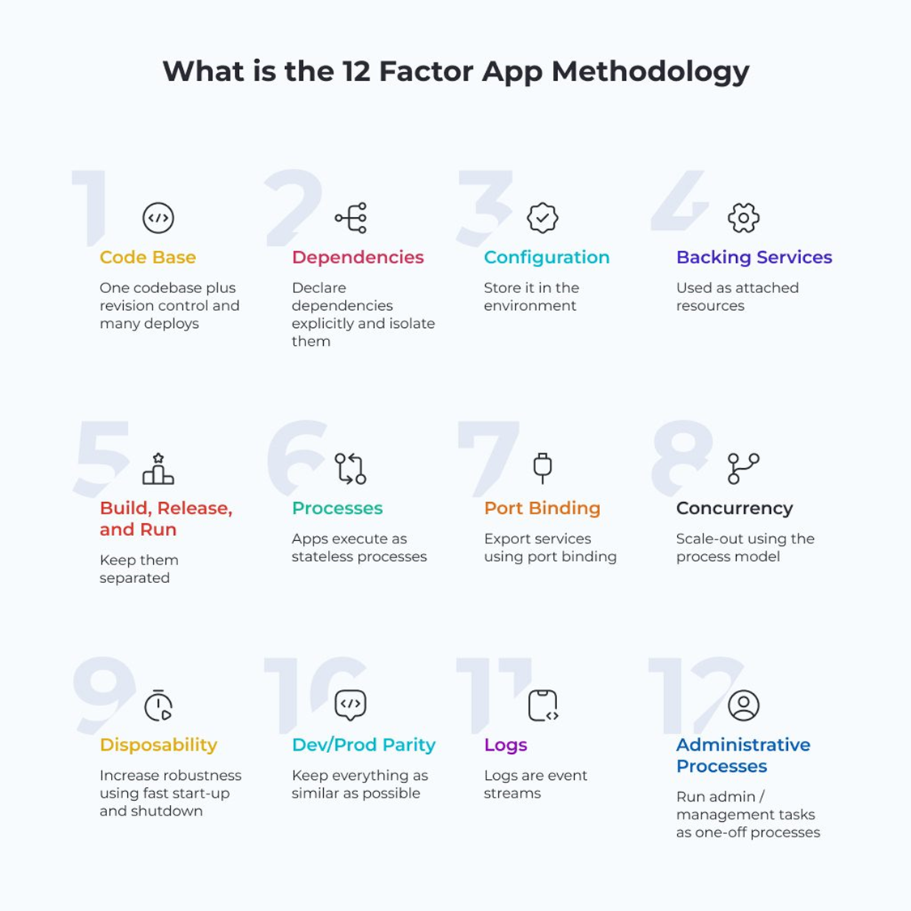
Quote จาก [The Twelve-Factor App](https://12factor.net/)
> The Twelve-Factor App เป็นแนวทางปฏิบัติที่ออกแบบมาเพื่อช่วยในการพัฒนาและบริหารจัดการแอปพลิเคชันในสภาพแวดล้อมคลาวด์ โดยเฉพาะการพัฒนาแบบ SaaS (Software as a Service) แนวทางนี้เน้นการจัดการโค้ด การตั้งค่า การเก็บข้อมูล และการปรับสเกลของแอปเพื่อให้สามารถทำงานในสภาพแวดล้อมที่ซับซ้อนและปรับขยายได้อย่างมีประสิทธิภาพ
> 1. Codebase (ฐานโค้ด)
แอปพลิเคชันต้องมีฐานโค้ดเดียว แต่สามารถปรับใช้ (deploy) ได้หลายเวอร์ชัน เช่น development, staging, production โดยแต่ละเวอร์ชันใช้ฐานโค้ดเดียวกันแต่แตกต่างใน configuration
> 2. Dependencies (การจัดการ dependencies)
แอปต้องประกาศ dependencies ทั้งหมดที่จำเป็นในไฟล์ manifest (เช่น package.json สำหรับ Node.js) และจัดการโดยแยกออกจากระบบ (system-wide dependencies)
> 3. Configurations (การตั้งค่า)
การตั้งค่าควรแยกออกจากโค้ด โดยใช้ environment variables (เช่น keys, URLs) เพื่อให้การตั้งค่าต่างๆ เปลี่ยนแปลงได้ง่ายสำหรับการ deploy แต่ละ environment
> 4. Backing services (บริการสำรอง)
ทุกบริการที่แอปพึ่งพาควรถูกมองว่าเป็น resource ที่แนบง่าย เช่น databases, message queues หรือ external services โดยสามารถเปลี่ยนบริการสำรองได้โดยไม่ต้องแก้โค้ด
> 5. Build, release, run (การสร้าง, การปล่อย, การทำงาน)
แอปพลิเคชันควรมีขั้นตอนชัดเจนในการ build (เตรียมโค้ด), release (รวมโค้ดและการตั้งค่า), และ run (การทำงานจริง) เพื่อแยกการจัดการในแต่ละขั้นตอนออกจากกัน
> 6. Processes (กระบวนการ)
แอปพลิเคชันควรประกอบด้วย process ที่ไม่เก็บสถานะ (stateless) โดยการเก็บข้อมูลควรถูกแยกไปยังฐานข้อมูลหรือบริการอื่น
> 7. Port binding (การผูกพอร์ต)
แอปควรกำหนดการเชื่อมต่อผ่าน port binding โดยใช้ HTTP server ของตัวเอง เช่นการรันแอป Node.js ที่ binding ไปที่พอร์ต 3000
> 8. Concurrency (การประสานงาน)
แอปต้องสามารถทำงานหลายกระบวนการได้พร้อมกัน โดยแยกการทำงานที่แตกต่างออกเป็น process ย่อยๆ เพื่อให้สามารถปรับขนาดได้ง่าย
> 9. Disposability (ความสามารถในการทำลาย)
Process ควรสามารถหยุดหรือเริ่มใหม่ได้ง่ายและรวดเร็ว โดยไม่ทำให้แอปทำงานล้มเหลว
> 10. Dev/prod parity (ความเท่าเทียมระหว่างการพัฒนาและการใช้งาน)
สภาพแวดล้อมของการพัฒนา, staging, และ production ควรมีความสอดคล้องกันมากที่สุด เพื่อป้องกันปัญหาที่เกิดจากความแตกต่างของสภาพแวดล้อม
> 11. Logs (การบันทึกข้อมูล)
แอปพลิเคชันไม่ควรจัดการ logs โดยตรง แต่ควรส่งออก logs เป็น event stream เพื่อให้บริการอื่นๆ จัดการ
> 12. Admin processes (กระบวนการของผู้ดูแลระบบ)
คำสั่งบริหารจัดการชั่วคราว (เช่น migration หรือ cron jobs) ควรแยกออกจาก codebase หลัก และสามารถรันได้ในสภาพแวดล้อมที่มีการ deploy แอป

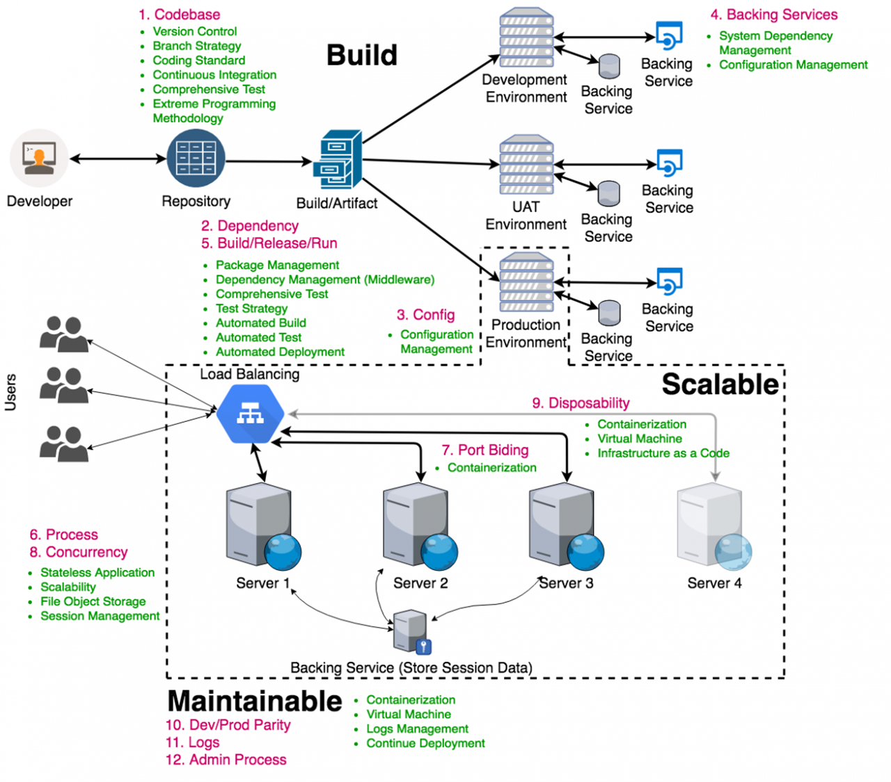

#### 📚 ทบทวนการใช้งาน Docker

##### What is Docker?

Docker คือ Software Container ถูกออกแบบมาเพื่อสร้างสภาพแวดล้อม
ให้ Application ของเราทำงานร่วมกันได้บน OS เดียวกัน ช่วยให้การ Setup และจัดการ Application ต่าง ๆ ทำได้ง่ายขึ้น

##### What is Container?

เปรียบเสมือนการ Pack รวม
App/Bins/Libs ต่างๆ เป็นก้อนเดียวกัน แล้วทำการกำหนดสภาพแวด
ล้อมการทำงานไว้ภายในตัวมันเอง

เมื่อต้องการนำไปใช้งานที่อื่นหรือบน
Production จริง ก็นำไปทั้งก้อน Container นี้เลย ทำให้สภาพแวดล้อมเหมือนกันทุกประการ

##### ทำไมต้องใช้ Docker และ Containers

- สามารถทำงานได้บน OS ใด ๆ ไม่ว่าจะเป็น Windows, Mac, Linux
- สามารถทำงานได้บน Cloud หรือ On-Premise
- สามารถทำงานได้บน Server หรือ Desktop
- สามารถทำงานได้บน VM หรือ Bare Metal
- สามารถทำงานได้บน Kubernetes, Swarm, Mesos, ECS, EKS, AKS, GKE
- สามารถทำงานได้บน CI/CD หรือ GitOps
- สามารถทำงานได้บน Dev, Staging, Production
- สามารถทำงานได้บน หลาย ๆ ระบบพร้อมกัน

##### Docker Alternatives
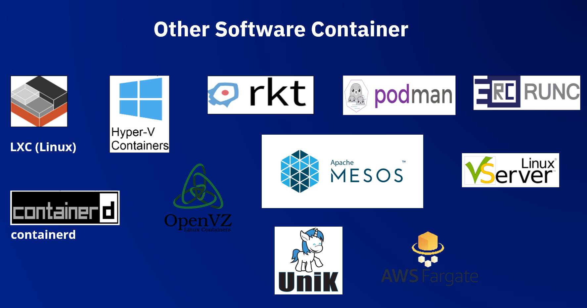
- Podman
- LXC
- LXD
- rkt
- CRI-O
- Kata Containers
- OpenVZ
- Virtuozzo
- Vagrant
- VMWare
- Hyper-V
- QEMU
- KVM

##### โครงสร้างและสถาปัตยกรรมของ Docker

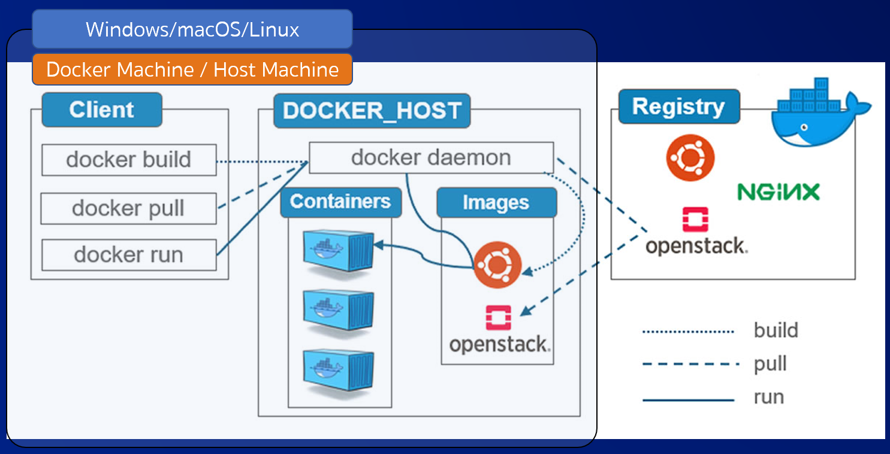

##### การใช้งาน Docker CLI

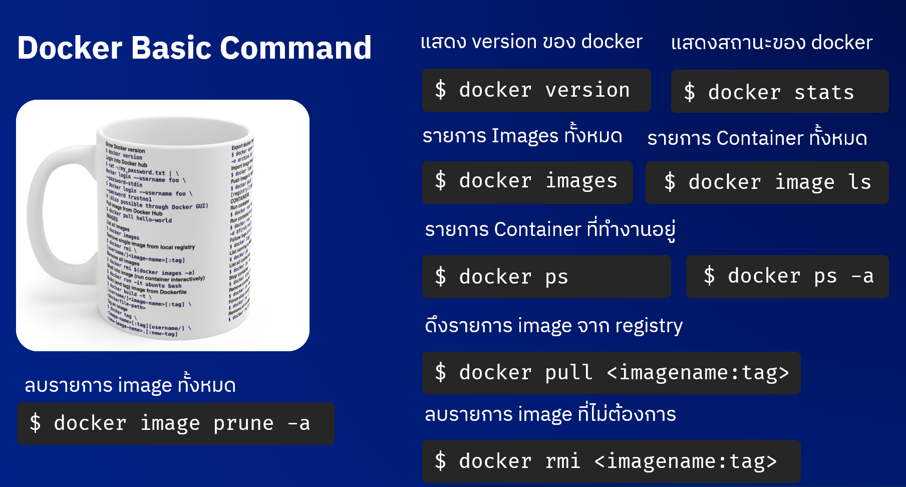

```bash
docker --version
docker info
docker run hello-world
docker ps
docker ps -a
docker images
docker pull nginx
docker run -d -p 8080:80 nginx
docker stop <container_id>
docker rm <container_id>
docker rmi <image_id>
docker exec -it <container_id> /bin/bash
docker logs <container_id>
docker inspect <container_id>
docker stats
docker system df
docker system prune
```
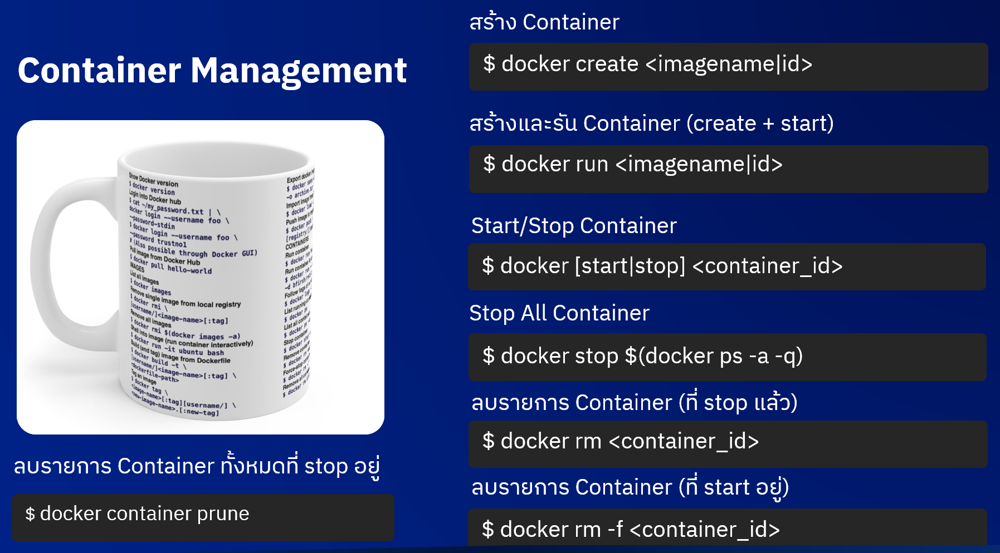

##### การใช้งาน CLI Container Management

สร้าง Container
```bash
docker run -d -p 8080:80 --name webserver nginx
```

เข้า Container
```bash
docker exec -it webserver /bin/bash
```

ลบ Container
```bash
docker rm -f webserver
```

##### Docker Container Lifecycle

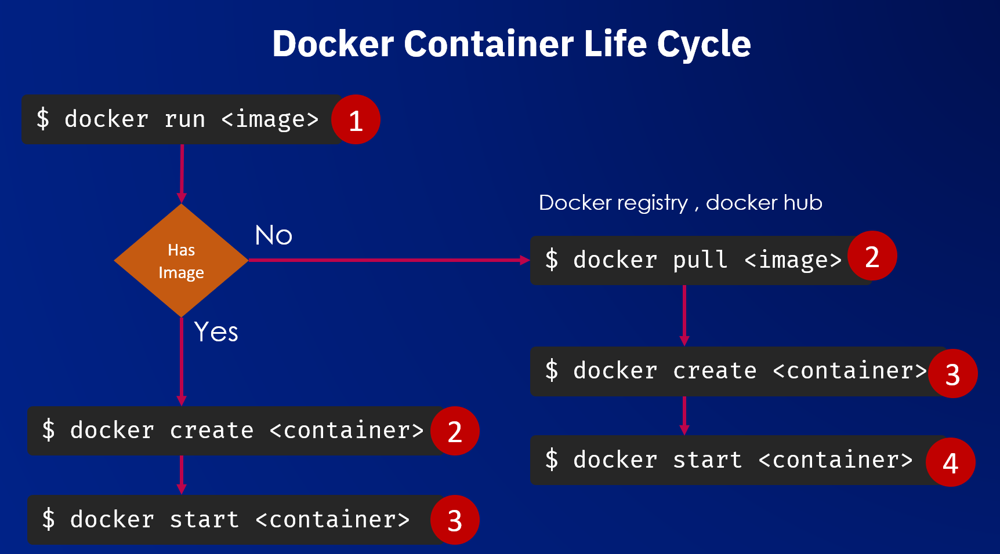

##### Docker Image

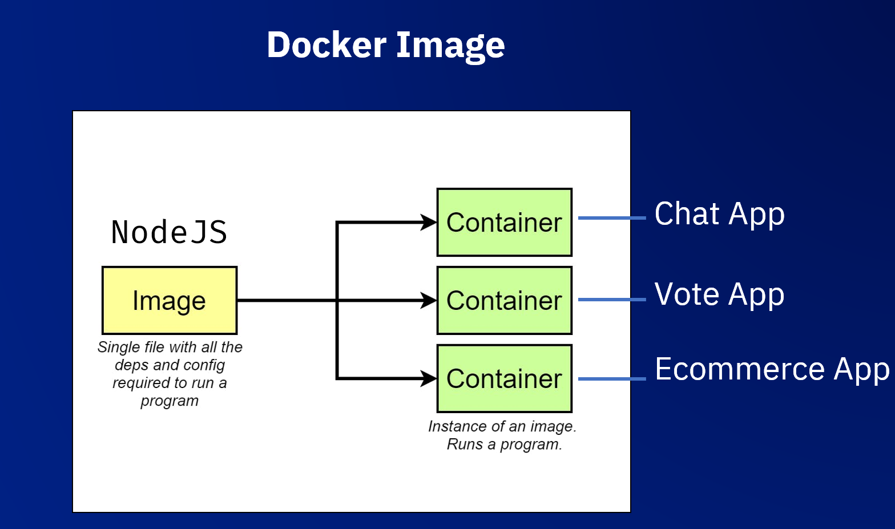


##### การทำ Port Mapping ของ Container

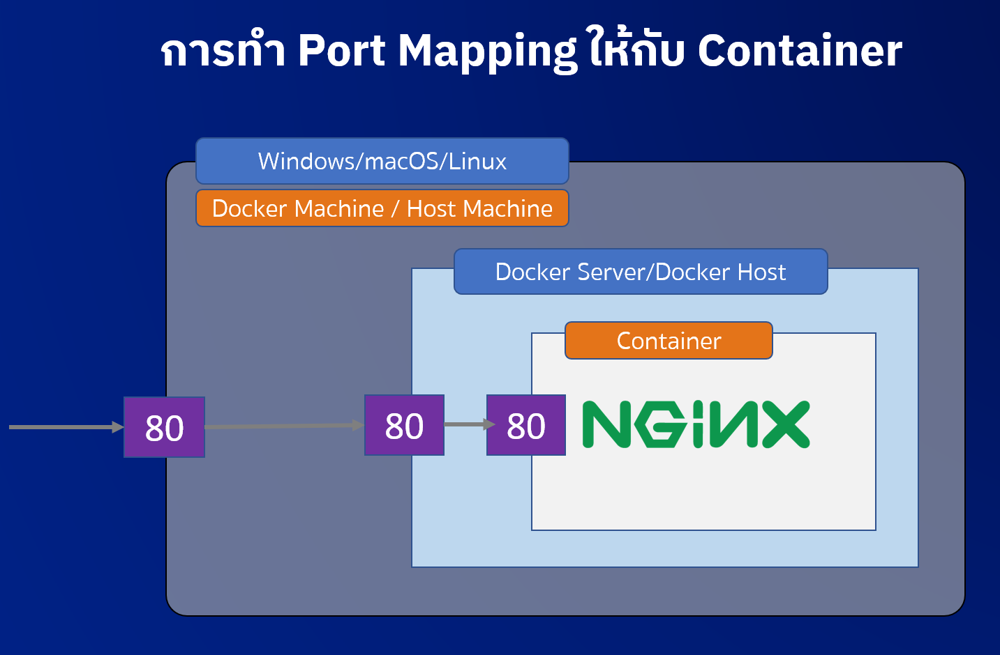

##### Docker Image Layers

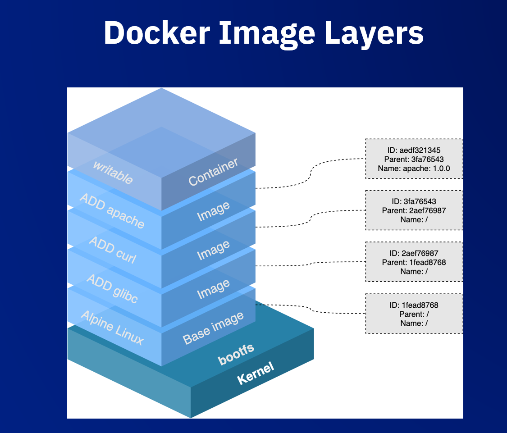

##### การใช้งาน Dockerfile


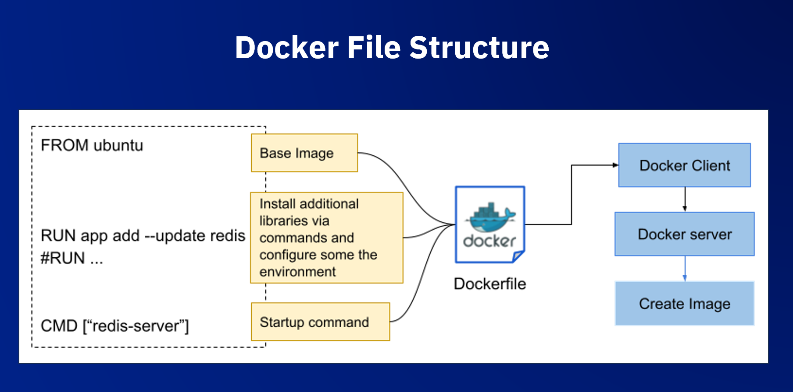

##### คำสั่งหลัก ๆ ของ Dockerfile

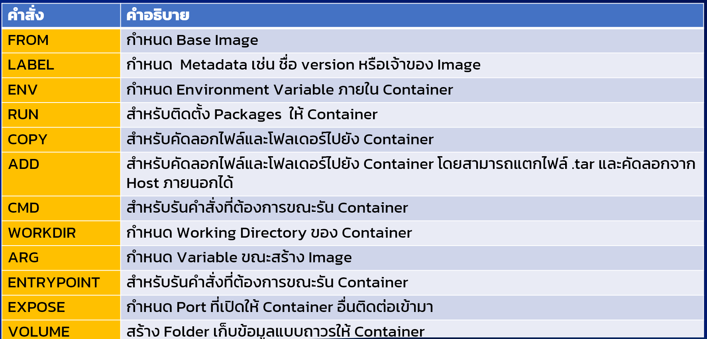

##### ตัวอย่างโปรเจค Node.js ที่ใช้ Dockerfile

```bash
mkdir my-node-app
cd my-node-app
npm init -y
npm install express
touch app.js
```

```javascript
const express = require('express');
const app = express();
const port = 3000;

app.get('/', (req, res) => {
  res.send('Hello World!');
});

app.listen(port, () => {
  console.log(`Example app listening at http://localhost:${port}`);
});
```

##### ตัวอย่าง Dockerfile สำหรับ Node.js Application

```Dockerfile
# Use the official image as a parent image
FROM node:18

# Set the working directory
WORKDIR /usr/src/app

# Copy package.json and package-lock.json to the working directory
COPY package*.json ./

# Install the dependencies
RUN npm install

# Copy the rest of the application
COPY . .

# Expose the port the app runs in
EXPOSE 3000

# Run the app
CMD ["node", "app.js"]
```

##### การ Build Docker Image จาก Dockerfile ด้วยคำสั่ง docker build ทำการ map port 3000 ของ Container ไปที่ port 3000 ของ Host

```bash
docker build -t my-node-app:1.0 .
```
ฺBuild และ Tag Image ด้วยชื่อ my-node-app และเวอร์ชั่น 1.0 จาก Dockerfile ที่อยู่ใน Directory ปัจจุบัน

##### การทดสอบ Image ที่ Build ด้วยการสร้าง Container และทดสอบการทำงานของ Application

```bash
docker run -d -p 3000:3000 my-node-app:1.0
```

##### Docker Compose คืออะไร


Docker Compose คือเครื่องมือที่ช่วยในการจัดการและสร้าง Container หลาย ๆ ตัวพร้อมกัน โดยใช้ไฟล์ YAML ที่เรียกว่า docker-compose.yml

##### การใช้งาน Docker Compose

```yaml
version: '3'

networks:
  my-network:
    driver: bridge

services:
  web:
    build: .
    ports:
        - "3000:3000"
    networks:
        - my-network
```

คำสั่งสำหรับการใช้งาน Docker Compose
```bash
docker-compose up -d
```

##### การใช้งาน Docker Compose สำหรับ NGINX Web Server

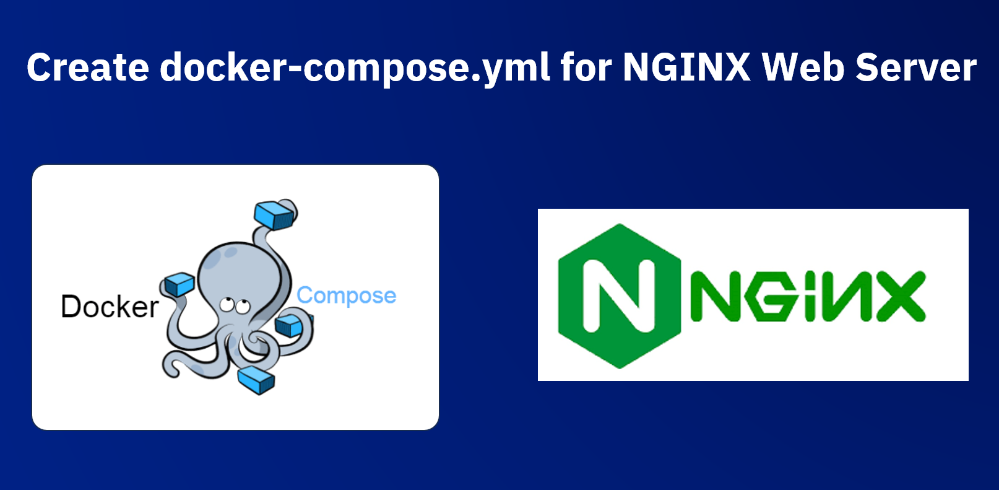

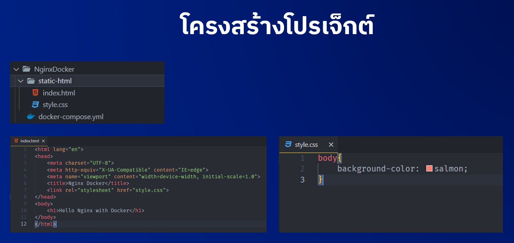

```yaml
networks:
  nginx_network:
    name: nginx_network
    driver: bridge

services:
  nginx:
    container_name: nginx
    image: nginx:stable-alpine
    volumes:
      - ./static-html:/usr/share/nginx/html
    ports:
      - "82:80"
    networks:
      - nginx_network
```

##### การใช้งาน Docker Compose สำหรับ Apache Webserver

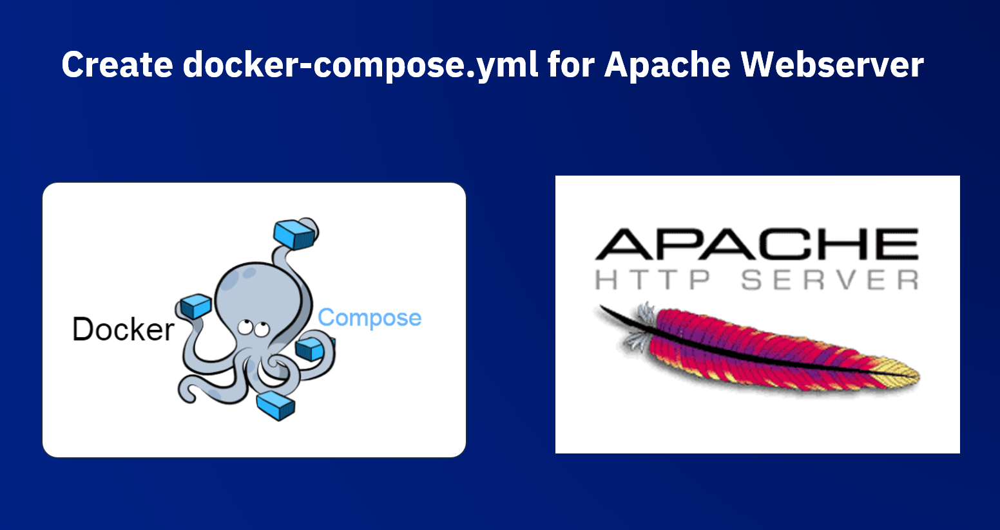

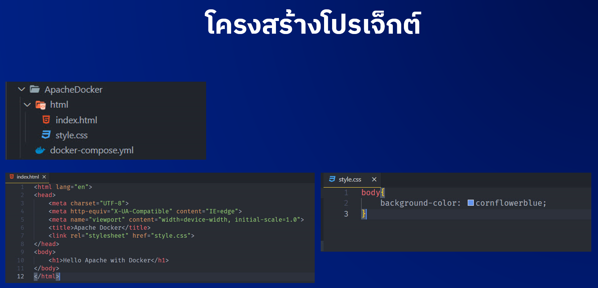

```yaml
networks:
  httpd_network:
    name: httpd_network
    driver: bridge

services:
  httpd:
    container_name: httpd
    image: httpd:2.4.41-alpine
    volumes:
      - ./html:/usr/local/apache2/htdocs/
    ports:
      - "81:80"
    networks:
      - httpd_network
```

##### การใช้งาน Docker Compose สำหรับ LAMP Stack

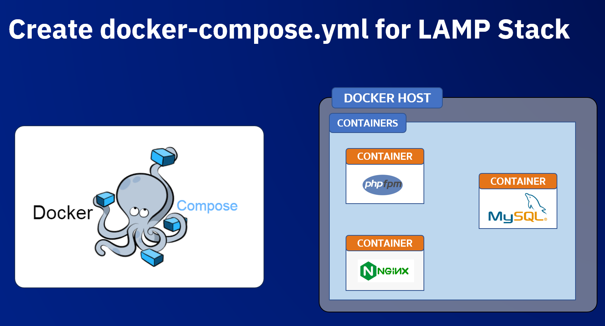

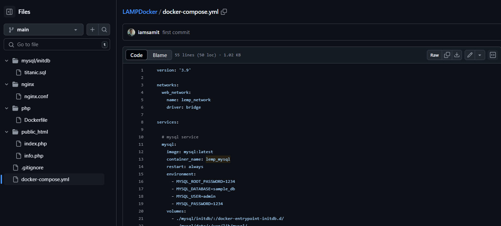

```yaml
networks:
  lemp_network:
    name: lemp_network
    driver: bridge

services:

  # mysql service
  mysql:
    image: mysql:latest
    container_name: lemp_mysql
    restart: always
    environment:
      - MYSQL_ROOT_PASSWORD=1234
      - MYSQL_DATABASE=sample_db
      - MYSQL_USER=admin
      - MYSQL_PASSWORD=1234
    volumes:
      - ./mysql/initdb/:/docker-entrypoint-initdb.d/
      - ./mysql/data/:/var/lib/mysql/
    ports:
      - 4406:3306
    networks:
      - lemp_network

  # php service
  php:
    depends_on:
      - mysql
    build: ./php
    container_name: lemp_php
    restart: always
    volumes:
      - ./public_html/:/var/www/html/
    expose:
      - 9000
    networks:
      - lemp_network

  # nginx service
  nginx:
    depends_on:
      - php
    image: nginx:stable-alpine
    container_name: lemp_nginx
    restart: always
    volumes:
      - ./public_html/:/var/www/html/
      - ./nginx/nginx.conf:/etc/nginx/conf.d/default.conf:ro
    ports:
      - 8800:80
    networks:
      - lemp_network
```

##### การใช้งาน Docker Compose สำหรับ MERN Stack

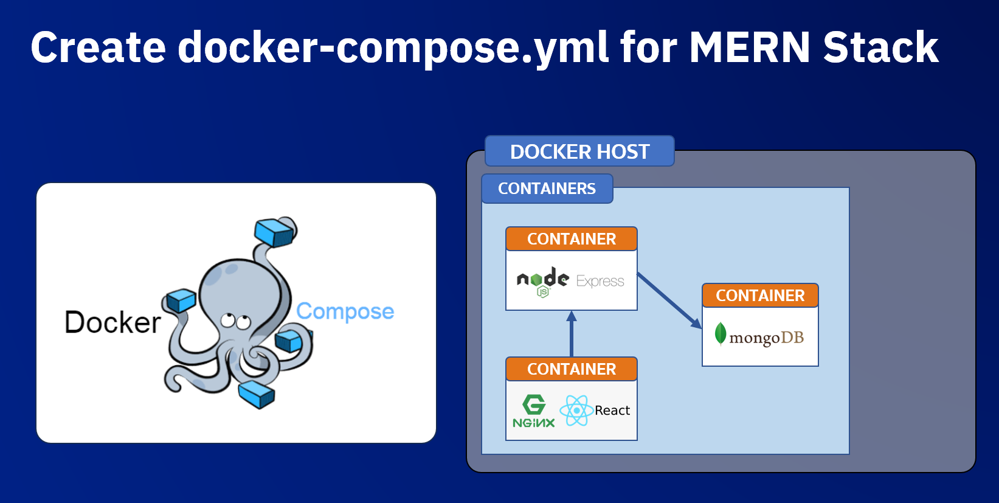

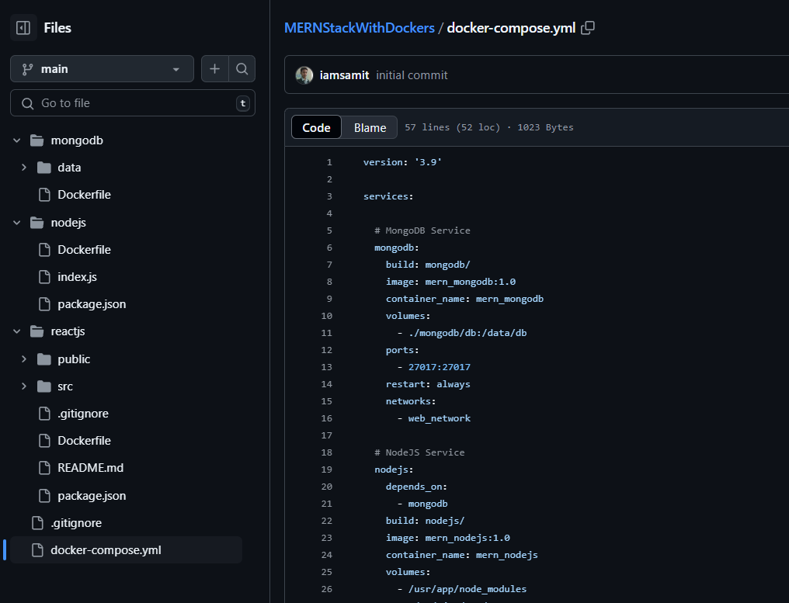

```yaml
networks:
  mern_network:
    name: mern_network
    driver: bridge

services:

  # MongoDB Service
  mongodb:
    build: mongodb/
    image: mern_mongodb:1.0
    container_name: mern_mongodb
    volumes:
      - ./mongodb/db:/data/db
    ports:
      - 27017:27017
    restart: always
    networks:
      - mern_network
  
  # NodeJS Service
  nodejs:
    depends_on:
      - mongodb
    build: nodejs/
    image: mern_nodejs:1.0
    container_name: mern_nodejs
    volumes:
      - /usr/app/node_modules
      - ./nodejs:/usr/app
    ports:
      - 4000:3000
    environment:
      - DATABASE_USER=admin
      - DATABASE_PASSWORD=1234
      - DATABASE_HOST=mongodb
    restart: always
    networks:
      - mern_network

  # React Service
  react:
    depends_on:
      - nodejs
    build: reactjs/
    image: mern_react:1.0
    container_name: mern_react
    volumes:
      - /usr/app/node_modules
      - ./reactjs:/usr/app
    ports:
      - 8181:3000
    restart: always
    networks:
      - mern_network
```

##### การ Tag และ Push Image ไปยัง Docker Hub

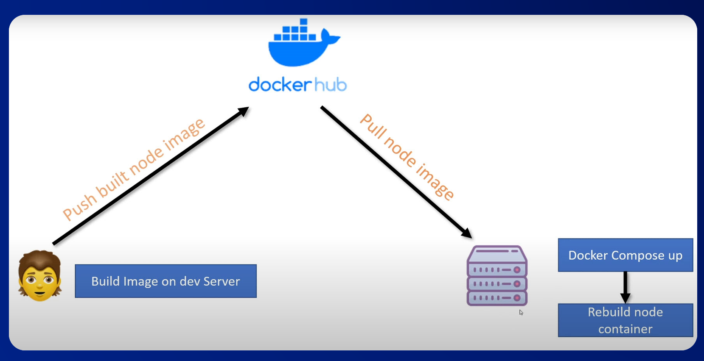

```bash
docker tag my-node-app:1.0 my-node-app:latest
docker logout
docker login
docker push my-node-app:latest
```